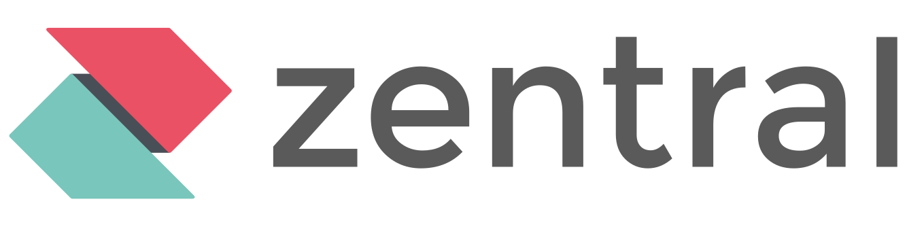

# Welcome to Zentral

{ width="640" }

Zentral is an open-source hub for endpoint protection.

Extensions are available for many agents, to deploy and configure them, and to collect, normalize and process the events they generate.

Connectors exist for device management solutions, to track inventory changes, and if possible, dynamically change group assignments.

Events are stored in one of the supported [event stores](#event-stores). They can be forwarded to third party SIEMs.

Filters can be configured to display events, and trigger actions outside of Zentral.

## Quick start

You can deploy it on your machine with [Docker](./deployment/docker-compose).

## Supported agents

* Jamf Protect
* Munki
* Osquery
* Santa
* Turbo (the Zentral agent)

## Inventory sources

* Jamf
* Puppet
* Workspace One

## Event stores

* [AWS Kinesis](https://aws.amazon.com/kinesis/)
* [ClickHouse](https://www.clickhouse.com/)
* [Datadog](https://www.datadoghq.com/)
* [Elasticsearch](https://www.elastic.co/elasticsearch)
* [OpenSearch](https://opensearch.org/)
* [Panther](https://panther.com/)
* [Snowflake](https://www.snowflake.com/en/)
* [Splunk](https://www.splunk.com/)
* [Sumo Logic](https://www.sumologic.com/)
* Amazon S3, as [Parquet](https://parquet.apache.org/) files
* Generic HTTP POST endpoint

See [Event stores](./configuration/stores) for the options of each backend.

## Actions

* Slack
* HTTP webhooks
